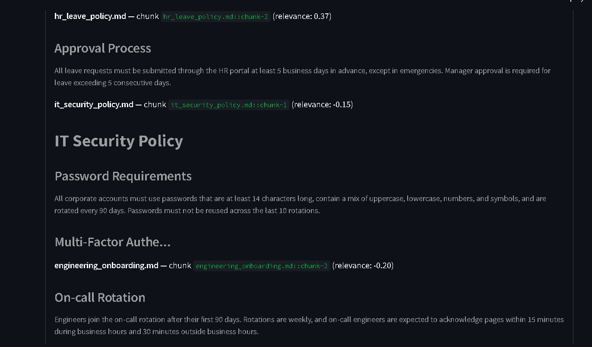
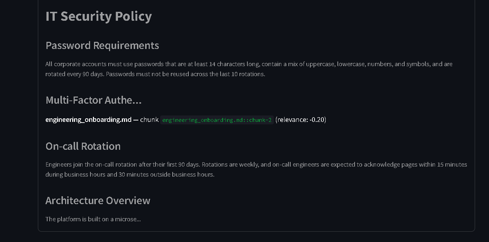

# RAG-Based Enterprise Knowledge Assistant

An AI-powered Retrieval-Augmented Generation (RAG) engine for enterprise knowledge retrieval and Q&A. Upload your documents, ask questions in plain English, and get accurate answers with exact source citations — no more digging through folders to find one fact.

Built with **FastAPI**, **Streamlit**, **LangChain**, and **FAISS**. Uses **Sentence-Transformers** for local, on-device embeddings and the **Groq API** for fast LLM-generated answers. Fully containerized with **Docker**.

---

## Table of Contents

- [Why This Exists](#why-this-exists)
- [How It Works](#how-it-works)
- [Tech Stack](#tech-stack)
- [Project Structure](#project-structure)
- [Getting Started](#getting-started)
- [Running with Docker](#running-with-docker)
- [API Reference](#api-reference)
- [Configuration](#configuration)
- [Running Tests](#running-tests)
- [Design Notes](#design-notes)
- [Limitations](#limitations)
- [License](#license)

---

## Why This Exists

Keyword search only finds documents containing the *exact words* you typed. If a policy document says "annual leave" and you search "vacation days," keyword search comes up empty — even though it's the right document.

This project uses semantic search instead: it converts both your documents and your questions into vectors that capture *meaning*, so it finds the right passage even when your wording doesn't match the source text. It then hands only the relevant passages to an LLM, which answers using that context — and every answer comes with a citation back to its exact source.

## How It Works

```
Documents (PDF / TXT / MD)
        |
        v
  Load + Chunk (LangChain)
        |
        v
  Embed locally (Sentence-Transformers)
        |
        v
  Store in FAISS index
        |
        v
  ─────────────────────────
        |
   User question
        |
        v
  Embed question (same model)
        |
        v
  Similarity search in FAISS
        |
        v
  Top-K relevant chunks retrieved
        |
        v
  Prompt built (context + question)
        |
        v
  Groq LLM generates the answer   <- only step that leaves your machine
        |
        v
  Answer + citations returned to the UI
```

Embeddings and retrieval run **entirely locally** — only the final prompt (retrieved text + your question, never the raw documents) is sent to Groq for answer generation.

## Tech Stack

| Layer | Technology | Purpose |
|---|---|---|
| Frontend | [Streamlit](https://streamlit.io) | Chat interface with file upload and source citations |
| Backend / API | [FastAPI](https://fastapi.tiangolo.com) | REST API for ingestion and querying |
| Orchestration | [LangChain](https://www.langchain.com) | Document loading, chunking, prompt chaining |
| Embeddings | [Sentence-Transformers](https://www.sbert.net) (`all-MiniLM-L6-v2`) | Local, free, CPU-based text embeddings |
| Vector store | [FAISS](https://github.com/facebookresearch/faiss) | Fast similarity search over embedded chunks |
| LLM | [Groq API](https://console.groq.com) (`llama-3.1-8b-instant`) | Fast, hosted answer generation |
| Containerization | Docker / Docker Compose | Reproducible two-container deployment |

## Project Structure

```
enterprise-rag-engine/
├── app/
│   ├── config.py         # Settings: models, paths, chunk size, API key
│   ├── ingestion.py       # Document loading + chunking
│   ├── vectorstore.py     # Local embeddings + FAISS
│   ├── rag_chain.py       # Retrieval + prompt + Groq generation
│   └── main.py            # FastAPI app and endpoints
├── streamlit_ui/
│   └── app.py             # Chat UI
├── scripts/
│   └── ingest_cli.py       # Bulk-ingest documents from the command line
├── docker/
│   ├── Dockerfile.api
│   └── Dockerfile.streamlit
├── data/
│   └── sample_docs/        # Sample HR / IT / onboarding docs to try it out
├── tests/
│   └── test_ingestion.py
├── docker-compose.yml
├── requirements.txt
└── .env.example
```

## Getting Started

### Prerequisites

- Python 3.11+
- A free [Groq API key](https://console.groq.com) — no credit card required

### 1. Clone and set up a virtual environment

```bash
git clone https://github.com/sagarmahatpure21/enterprise-rag-engine.git
cd enterprise-rag-engine
python -m venv venv
source venv/bin/activate      # Windows: venv\Scripts\activate
```

### 2. Install dependencies

```bash
pip install -r requirements.txt
```

### 3. Configure environment variables

```bash
cp .env.example .env
```

Open `.env` and paste in your `GROQ_API_KEY`.

### 4. Ingest the sample documents

```bash
python -m scripts.ingest_cli --path data/sample_docs
```

This builds your first FAISS index. The first run also downloads the embedding model (~80MB, one-time — needs internet access).

### 5. Start the API

```bash
uvicorn app.main:app --reload --port 8000
```

Interactive API docs: [http://localhost:8000/docs](http://localhost:8000/docs)

### 6. Start the UI (in a separate terminal)

```bash
source venv/bin/activate
streamlit run streamlit_ui/app.py
```

Open [http://localhost:8501](http://localhost:8501) and start chatting with your documents.

## Running with Docker

```bash
docker compose up --build
```

Make sure `.env` contains a valid `GROQ_API_KEY` before running — the API container reads it via `env_file`. This starts two containers:

| Service | Port | Description |
|---|---|---|
| `api` | 8000 | FastAPI backend |
| `ui` | 8501 | Streamlit frontend |

## API Reference

| Method | Endpoint | Description |
|---|---|---|
| `GET` | `/health` | Liveness check |
| `GET` | `/stats` | Index size, embedding/LLM model, chunk settings |
| `POST` | `/ingest` | Upload one or more documents to embed and index |
| `POST` | `/query` | Ask a question, get an answer + citations |
| `DELETE` | `/index` | Clear the vector index |

**Example query:**

```bash
curl -X POST http://localhost:8000/query \
  -H "Content-Type: application/json" \
  -d '{"question": "How many days of annual leave do employees get?"}'
```

**Example response:**

```json
{
  "question": "How many days of annual leave do employees get?",
  "answer": "Full-time employees accrue 24 days of paid annual leave per year, credited at 2 days per month. (Source: hr_leave_policy.md)",
  "citations": [
    {
      "source": "hr_leave_policy.md",
      "chunk_id": "hr_leave_policy.md::chunk-1",
      "page": 0,
      "snippet": "Full-time employees accrue 24 days of paid annual leave...",
      "relevance_score": 0.87
    }
  ]
}
```

## Configuration

All settings are controlled via environment variables (see `.env.example`):

| Variable | Default | Description |
|---|---|---|
| `GROQ_API_KEY` | — | Your Groq API key (required) |
| `RAG_LLM_MODEL` | `llama-3.1-8b-instant` | Groq model used for generation |
| `RAG_EMBEDDING_MODEL` | `sentence-transformers/all-MiniLM-L6-v2` | Local embedding model |
| `RAG_CHUNK_SIZE` | `1000` | Characters per chunk |
| `RAG_CHUNK_OVERLAP` | `150` | Overlap between consecutive chunks |
| `RAG_TOP_K` | `4` | Number of chunks retrieved per question |
| `RAG_API_URL` | `http://localhost:8000` | Backend URL the Streamlit UI calls |

## Running Tests

```bash
pytest tests/ -v
```

Ingestion and chunking tests run with no external services or API key required.

## Design Notes

- **Local embeddings, hosted LLM by design, not by accident.** Embedding is cheap and fast enough to run on any CPU for free, so it stays local — keeping document text on-device. Generation benefits far more from fast, hosted inference, so that's the one call sent to Groq.
- **Citations come from retrieval metadata, not the LLM's own text.** Every citation is built directly from the chunks actually retrieved, so it stays accurate regardless of how well the model references its sources in prose.
- **FAISS only.** No separate vector database server to run — the entire index is just files on disk.
- **Supported file types are PDF, TXT, and MD.** Kept deliberately narrow to keep the codebase simple and easy to reason about.

## Limitations

This is a portfolio-scale project, not a production system. Notably missing:

- No authentication or access control on any endpoint
- No rate limiting (Groq's free tier has usage limits)
- No duplicate-document detection on ingestion
- No automated evaluation of answer quality
- CORS is wide open (`allow_origins=["*"]`)

See the codebase's inline comments in `app/main.py` and `app/config.py` for more context on these trade-offs.

## Application Screenshots

### FastAPI Swagger API


### FastAPI Swagger Schemas


### Streamlit Knowledge Base


### RAG Query and Response


### RAG Source Citations


### RAG Source Details and Retrieved Context
