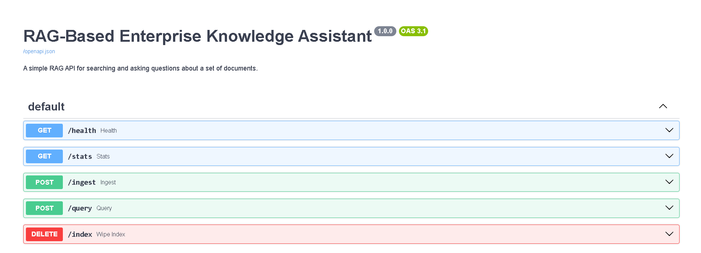
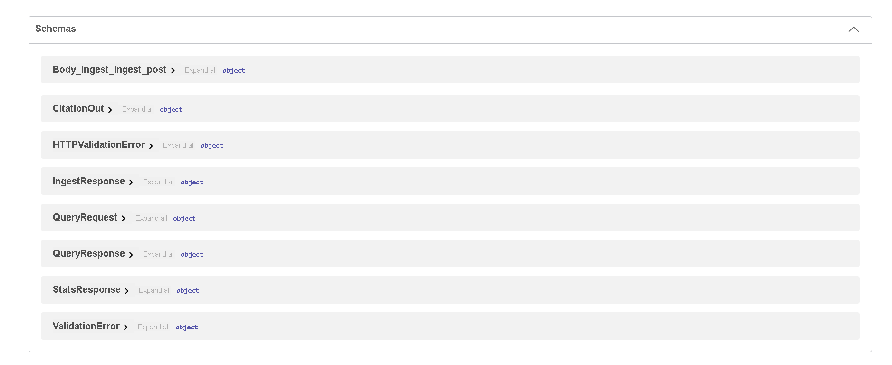
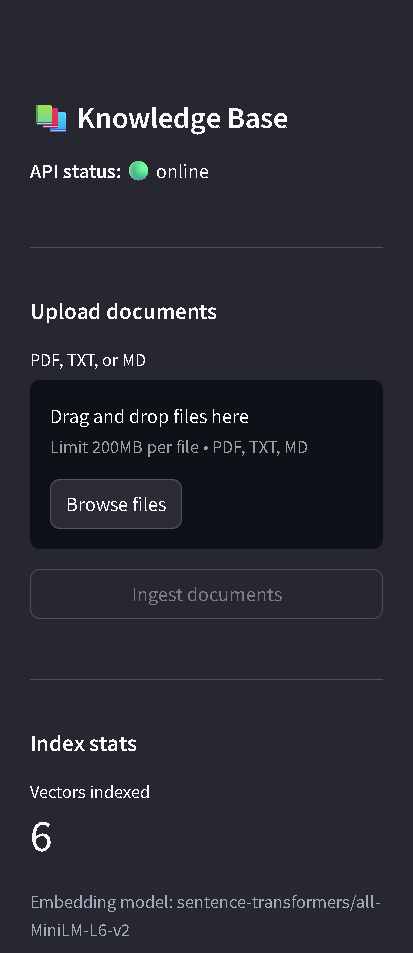
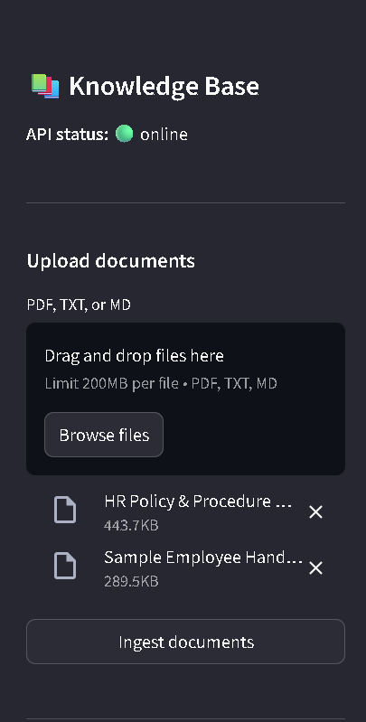
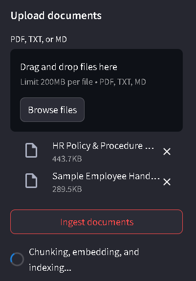
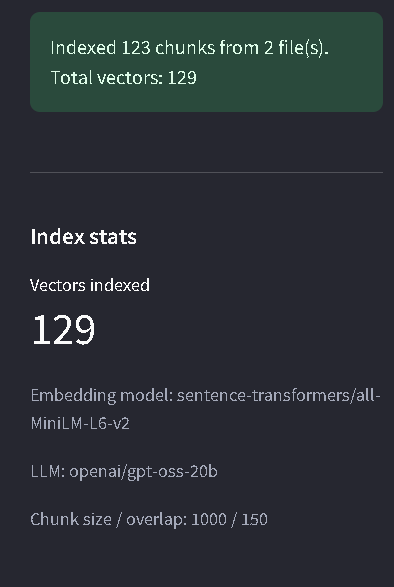
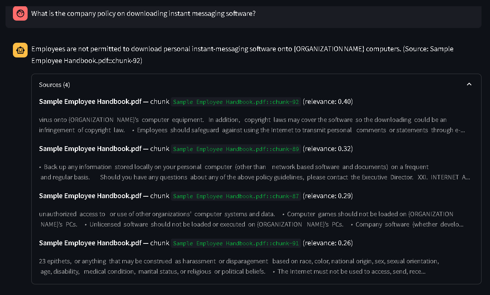
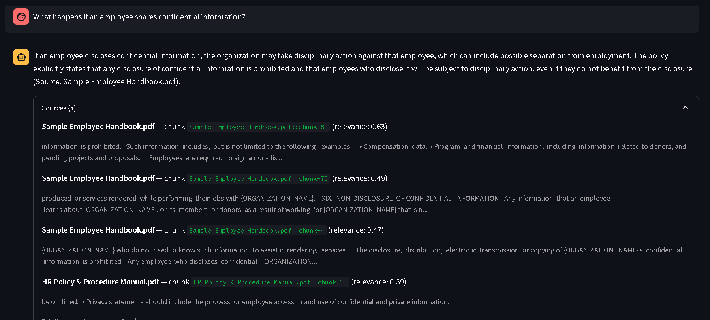

# RAG-Based Enterprise Knowledge Assistant

An enterprise-focused Retrieval-Augmented Generation (RAG) application for searching documents and answering questions in natural language with source-grounded responses.

Users can upload supported documents, ask questions about their contents, and receive answers based on retrieved document chunks together with source citations.

Built with **FastAPI**, **Streamlit**, **LangChain**, **FAISS**, **Sentence-Transformers**, **Groq**, and **Docker**.

> This is a portfolio-scale project designed to demonstrate practical RAG, semantic search, vector retrieval, API development, and LLM integration. It is not a production enterprise knowledge-management platform.

---

## Table of Contents

* [Overview](#overview)
* [Why RAG](#why-rag)
* [Architecture](#architecture)
* [How It Works](#how-it-works)
* [Tech Stack](#tech-stack)
* [Project Structure](#project-structure)
* [Supported Documents](#supported-documents)
* [Getting Started](#getting-started)
* [Running with Docker](#running-with-docker)
* [API Reference](#api-reference)
* [RAG Query Example](#rag-query-example)
* [Configuration](#configuration)
* [Design Decisions](#design-decisions)
* [Limitations](#limitations)
* [Application Screenshots](#application-screenshots)

---

## Overview

Traditional keyword search depends heavily on exact words appearing in a document.

For example, a policy may discuss **annual leave**, while a user asks:

> How many vacation days do employees receive?

A keyword search may miss the relevant passage because the wording is different.

This project uses **semantic retrieval** instead. Documents and user questions are converted into vector representations, allowing the system to retrieve passages based on meaning rather than exact keyword matches.

The retrieved passages are then supplied to an LLM through a RAG prompt. The model generates an answer using that retrieved context, while the application exposes the source documents and retrieved chunks used to support the answer.

---

## Why RAG

The system separates knowledge retrieval from answer generation:

```text
Documents
   |
   v
Chunking
   |
   v
Local Embeddings
   |
   v
FAISS Vector Index
   |
   +--------------------+
                        |
                   User Question
                        |
                        v
                 Query Embedding
                        |
                        v
                  FAISS Search
                        |
                        v
                Top-K Chunks
                        |
                        v
             Context + Question
                        |
                        v
              Groq LLM Generation
                        |
                        v
                Answer + Citations
```

This design allows the LLM to answer using retrieved document context instead of relying only on information stored in the model's parameters.

---

## Architecture

```text
                         +----------------------+
                         |   PDF / TXT / MD     |
                         |      Documents       |
                         +----------+-----------+
                                    |
                                    v
                         +----------------------+
                         |  LangChain Loading   |
                         |   + Chunking         |
                         +----------+-----------+
                                    |
                                    v
                         +----------------------+
                         | Sentence-Transformers|
                         |  Local Embeddings    |
                         +----------+-----------+
                                    |
                                    v
                         +----------------------+
                         |   FAISS Vector       |
                         |       Index          |
                         +----------+-----------+
                                    |
                                    |
                       +------------v-------------+
                       |       User Question      |
                       +------------+-------------+
                                    |
                                    v
                         +----------------------+
                         | Query Embedding      |
                         | Same Embedding Model |
                         +----------+-----------+
                                    |
                                    v
                         +----------------------+
                         | FAISS Similarity      |
                         | Search                |
                         +----------+-----------+
                                    |
                                    v
                         +----------------------+
                         | Top-K Relevant        |
                         | Chunks                |
                         +----------+-----------+
                                    |
                                    v
                         +----------------------+
                         | RAG Prompt            |
                         | Context + Question    |
                         +----------+-----------+
                                    |
                                    v
                         +----------------------+
                         | Groq API              |
                         | openai/gpt-oss-20b    |
                         +----------+-----------+
                                    |
                                    v
                         +----------------------+
                         | Answer + Source       |
                         | Citations             |
                         +----------------------+

        FastAPI -------------------- REST API
        Streamlit ------------------ User Interface
        Docker Compose ------------- Containerized Deployment
```

Embeddings and vector retrieval run locally. The application sends the final retrieval context and user question to Groq for answer generation.

---

## How It Works

### 1. Document ingestion

The application accepts:

* PDF
* TXT
* Markdown (`.md`)

Documents are loaded and split into smaller chunks using LangChain.

### 2. Embedding generation

Each document chunk is converted into a vector using the local Sentence-Transformers model:

```text
sentence-transformers/all-MiniLM-L6-v2
```

This runs locally and does not require an external embedding API.

### 3. FAISS indexing

The generated vectors are stored in a local FAISS index.

FAISS provides similarity search over the embedded document chunks without requiring a separate vector-database service.

### 4. Query processing

When a user asks a question:

```text
User Question
      |
      v
Query Embedding
      |
      v
FAISS Similarity Search
      |
      v
Top-K Relevant Chunks
```

The system retrieves the most relevant chunks from the document collection.

### 5. RAG generation

The retrieved chunks and the original question are placed into the RAG prompt and sent to the configured Groq model:

```text
openai/gpt-oss-20b
```

The generated response is returned to the API and displayed in the Streamlit interface.

### 6. Citations

Citations are generated from the retrieved chunk metadata rather than relying on the LLM to invent source references.

The interface displays the source document, chunk identifier, retrieved content, and relevance information.

---

## Tech Stack

| Layer            | Technology                                 | Purpose                                                            |
| ---------------- | ------------------------------------------ | ------------------------------------------------------------------ |
| Frontend         | Streamlit                                  | Interactive document upload and chat interface                     |
| Backend / API    | FastAPI                                    | REST API for ingestion, querying, statistics, and index management |
| Orchestration    | LangChain                                  | Document loading, chunking, and RAG workflow components            |
| Embeddings       | Sentence-Transformers (`all-MiniLM-L6-v2`) | Local CPU-based document and query embeddings                      |
| Vector Store     | FAISS                                      | Local similarity search over embedded chunks                       |
| LLM              | Groq API (`openai/gpt-oss-20b`)            | Hosted answer generation                                           |
| Containerization | Docker / Docker Compose                    | Reproducible API and UI deployment                                 |

---

## Project Structure

```text
enterprise-rag-engine/
├── app/
│   ├── __init__.py
│   ├── config.py              # Application configuration and model settings
│   ├── ingestion.py           # Document loading and chunking
│   ├── vectorstore.py         # Embeddings and FAISS operations
│   ├── rag_chain.py           # Retrieval, prompt construction, and LLM generation
│   └── main.py                # FastAPI application and REST endpoints
│
├── streamlit_ui/
│   └── app.py                 # Streamlit user interface
│
├── scripts/
│   └── ingest_cli.py          # Command-line document ingestion
│
├── docker/
│   ├── Dockerfile.api
│   └── Dockerfile.streamlit
│
├── data/
│   └── sample_docs/           # Bundled sample Markdown documents
│
├── screenshots/
│   ├── 01-fastapi-swagger-api.png
│   ├── 02-fastapi-swagger-schemas.png
│   ├── 03-streamlit-knowledge-base.png
│   ├── 04-rag-query-response.png
│   ├── 05-rag-source-citations.png
│   └── 06-rag-source-details.png
│
├── docker-compose.yml
├── requirements.txt
├── .env.example
└── README.md
```

Generated vector indexes, uploaded documents, virtual environments, secrets, and other local artifacts are excluded through `.gitignore`.

---

## Supported Documents

The application supports:

```text
PDF
TXT
Markdown (.md)
```

The repository includes sample Markdown documents for testing the ingestion and retrieval workflow.

Additional documents can be uploaded through the Streamlit interface or the API.

---

## Getting Started

### Prerequisites

* Python 3.11+
* Git
* A Groq API key
* Docker and Docker Compose for containerized execution

### 1. Clone the repository

```bash
git clone https://github.com/sagarmahatpure21/enterprise-rag-engine.git
cd enterprise-rag-engine
```

### 2. Create and activate a virtual environment

```bash
python -m venv venv
```

Linux / WSL2:

```bash
source venv/bin/activate
```

Windows:

```powershell
venv\Scripts\activate
```

### 3. Install dependencies

```bash
pip install -r requirements.txt
```

### 4. Configure environment variables

Copy the example environment file:

```bash
cp .env.example .env
```

Open `.env` and add your Groq API key:

```text
GROQ_API_KEY=your_groq_api_key
```

Do not commit the real `.env` file or API key to GitHub.

### 5. Ingest the sample documents

```bash
python -m scripts.ingest_cli --path data/sample_docs
```

This creates the FAISS index from the sample documents.

The first execution also downloads the Sentence-Transformers embedding model if it is not already available locally.

### 6. Start the FastAPI backend

```bash
uvicorn app.main:app --reload --port 8000
```

FastAPI documentation:

```text
http://localhost:8000/docs
```

### 7. Start the Streamlit interface

Open a second terminal and activate the same virtual environment:

```bash
source venv/bin/activate
```

Then:

```bash
streamlit run streamlit_ui/app.py
```

Open:

```text
http://localhost:8501
```

---

## Running with Docker

The application can also be started using Docker Compose:

```bash
docker compose up --build
```

Before starting the containers, make sure `.env` contains a valid:

```text
GROQ_API_KEY
```

The deployment contains two application services:

| Service | Port | Role               |
| ------- | ---: | ------------------ |
| `api`   | 8000 | FastAPI backend    |
| `ui`    | 8501 | Streamlit frontend |

---

## API Reference

| Method   | Endpoint  | Description                                          |
| -------- | --------- | ---------------------------------------------------- |
| `GET`    | `/health` | Application health check                             |
| `GET`    | `/stats`  | Index size and model/chunk configuration             |
| `POST`   | `/ingest` | Upload and index documents                           |
| `POST`   | `/query`  | Ask a question and retrieve an answer with citations |
| `DELETE` | `/index`  | Clear the local vector index                         |

FastAPI also exposes an interactive Swagger UI at:

```text
http://localhost:8000/docs
```

---

## RAG Query Example

Example request:

```bash
curl -X POST http://localhost:8000/query \
  -H "Content-Type: application/json" \
  -d '{"question": "How many days of annual leave do employees get?"}'
```

Example response:

```json
{
  "question": "How many days of annual leave do employees get?",
  "answer": "Full-time employees accrue 24 days of paid annual leave per year, credited at 2 days per month.",
  "citations": [
    {
      "source": "hr_leave_policy.md",
      "chunk_id": "hr_leave_policy.md::chunk-1",
      "page": 0,
      "snippet": "Full-time employees accrue 24 days of paid annual leave...",
      "relevance_score": 0.87
    }
  ]
}
```

The exact response depends on the indexed documents and retrieved context.

---

## Configuration

The application exposes its main runtime settings through environment variables:

| Variable              | Default                                  | Description                                 |
| --------------------- | ---------------------------------------- | ------------------------------------------- |
| `GROQ_API_KEY`        | —                                        | Groq API key                                |
| `RAG_LLM_MODEL`       | `openai/gpt-oss-20b`                     | Groq model used for answer generation       |
| `RAG_EMBEDDING_MODEL` | `sentence-transformers/all-MiniLM-L6-v2` | Local embedding model                       |
| `RAG_CHUNK_SIZE`      | `1000`                                   | Characters per document chunk               |
| `RAG_CHUNK_OVERLAP`   | `150`                                    | Overlap between consecutive chunks          |
| `RAG_TOP_K`           | `4`                                      | Number of chunks retrieved per query        |
| `RAG_API_URL`         | `http://localhost:8000`                  | API endpoint used by the Streamlit frontend |

Keep the README, `.env.example`, and application configuration synchronized when changing the LLM model.

---

## Design Decisions

### Local embeddings

The embedding model runs locally using Sentence-Transformers.

This avoids an external embedding API and keeps the embedding stage local to the machine.

### FAISS instead of a separate vector database

FAISS provides the similarity-search capability required by this project without requiring another database service.

The vector index is stored locally and can be recreated from the source documents.

### Hosted LLM

Answer generation uses the Groq API with:

```text
openai/gpt-oss-20b
```

This keeps the local application lightweight while providing access to hosted inference.

### Retrieval-grounded citations

The application derives citation information from the retrieved chunk metadata rather than relying on the LLM to generate source references itself.

This keeps the displayed source information tied to the actual retrieval results.

### Limited document formats

The project intentionally focuses on PDF, TXT, and Markdown documents to keep ingestion and retrieval behavior straightforward and easy to understand.

---

## Limitations

This is a portfolio-scale project rather than a production enterprise system.

Current limitations include:

* No authentication or authorization layer
* No rate limiting
* No duplicate-document detection
* No automated test suite
* No automated end-to-end answer-quality evaluation
* Local FAISS storage rather than a production vector database
* CORS is configured broadly for development
* Groq API availability and usage limits affect answer generation
* Retrieval quality depends on chunking, embeddings, and the indexed document collection

---

## Application Screenshots

### FastAPI Swagger API



### FastAPI Swagger Schemas



### Streamlit Knowledge Base






### RAG Query and Response




The screenshots demonstrate the API, document-management interface, question answering, retrieved sources, and citation information. The example questions and documents shown in the screenshots are demonstration data and may differ from the bundled sample Markdown documents.

